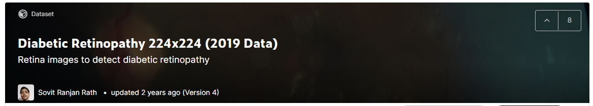
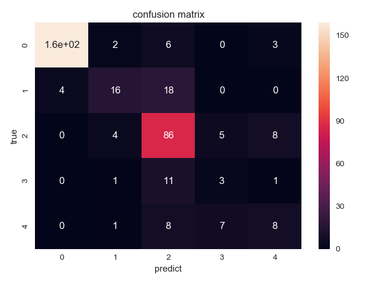

# Diabetic_Retinopathy_BalancedChallenge
> This is an example of the Frostylate disease classify

## Prerequisities
The following dependencies are needed:
- python == 3.6.5
- numpy >= 1.11.1
- SimpleITK >= 1.0.1
- opencv-python >= 3.3.0
- tensorflow-gpu == 1.14.0
- pandas >=0.20.1
- scikit-learn >= 0.17.1
- json >=2.0.9

## How to Use
more details can find on my wechat public article

## Result
**classify confused Matrix**

## Contact
* https://github.com/junqiangchen
* email: 1207173174@qq.com
* Contact: junqiangChen
* WeChat Number: 1207173174
* WeChat Public number: 最新医学影像技术
